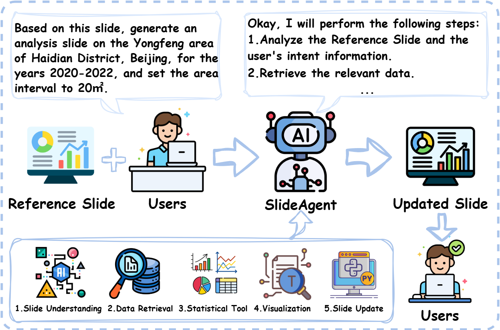
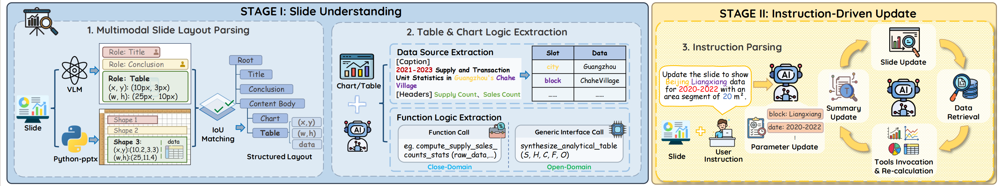
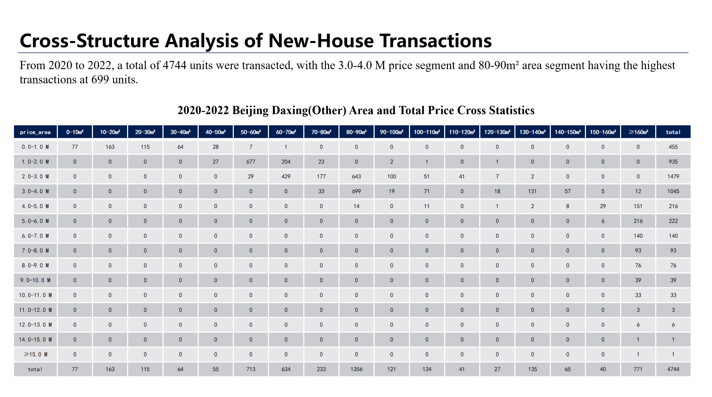
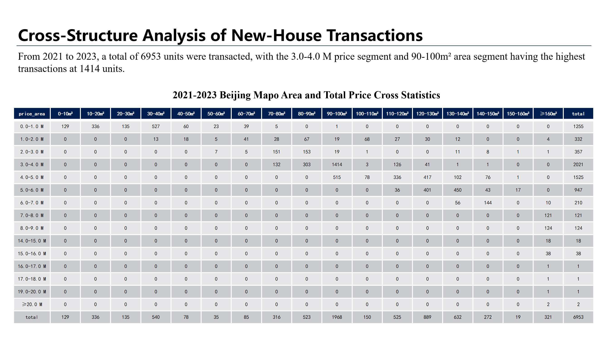

# 📊 SlideAgent: Automatic Slide Updating with User-Defined Dynamic Templates

## 📖 Introduction
**SlideAgent** is an agent-based framework designed to automate the updating of presentation slides using natural language instructions. It addresses the challenge of "Dynamic Slide Update via Natural Language Instructions on User-provided Templates".

Unlike traditional template-filling methods, SlideAgent can handle diverse, user-authored slide decks ("Bring-Your-Own-Template"). It preserves the original layout and style while updating charts, tables, and texts based on new data.

We also introduce **DynaSlide**, a large-scale benchmark containing **20,036** real-world instruction–execution triples to facilitate research in this domain.



## 🏗️ Architecture

SlideAgent operates in a two-stage pipeline as shown below:
<div align="center">
  
</div>

### 🔹 Stage I: Slide Understanding 
This stage parses the static slide into a structured representation with logic.

*   **Multimodal Layout Parsing**
    *   **Method**: Fuses visual perception (VLM) with code parsing (`python-pptx`) via IoU Matching.
    *   **Output**: Precisely identifies elements like Titles, Tables, and Charts.

*   **Table & Chart Logic Extraction** 
    *   **Data Source Extraction**: Maps visual text (e.g., "Guangzhou's Chahe Village") to specific database slots.
    *   **Function Logic Extraction**: Reconstructs aggregation logic (e.g., `compute_supply_sales`) for both Closed-Domain and Open-Domain tasks.

### 🔸 Stage II: Instruction-Driven Update
This stage executes the update loop based on user commands.

*   **Instruction Parsing & Execution**
    *   **Parameter Update**: Interprets instructions (e.g., "Update for 2020-2022") to modify query parameters.
    *   **Tool Execution**: Retrieves fresh data, recalculates statistics, and updates the slide layout.
    *   **Summary Update**: Generates fact-aware summaries aligned with the new data.


## 🛠️ Installation

**Python Environment**
```commandline
pip install -r requirements.txt
```

**Install poppler**
```commandline
conda install -c conda-forge poppler
```

**API Key**
Create a .env file in the project root and add your OpenAI API key:
```commandline
API_KEY=your_api_key
BASE_URL=your_base_url
MODEL_NAME=your_model_name
DASHSCOPE_API_KEY=your_dashscope_api_key
```

**Quick Start**
```commandline
python main.py
```

## 🎬 Demo 
### Example: Real Estate Data Update 

**Input Slide**
<div align="center">
  
  <p><i>Input Slide: 2020-2022 Beijing Daxing(Other) Area and Total Price Cross Statistics</i></p>
</div>


**User Instruction**
```commandline
Update the slide to show Beijing Mapo data for 2021-2023
``` 


**Output Slide**
<div align="center">
  
  <p><i>2021-2023 Beijing Mapo Area and Total Price Cross Statistics</i></p>
</div>


## Usage Workflow
Prepare PPT template files and .env configuration files
Configure database connection information
Run the appropriate main program
The system will automatically generate reports and save them to the specified directory